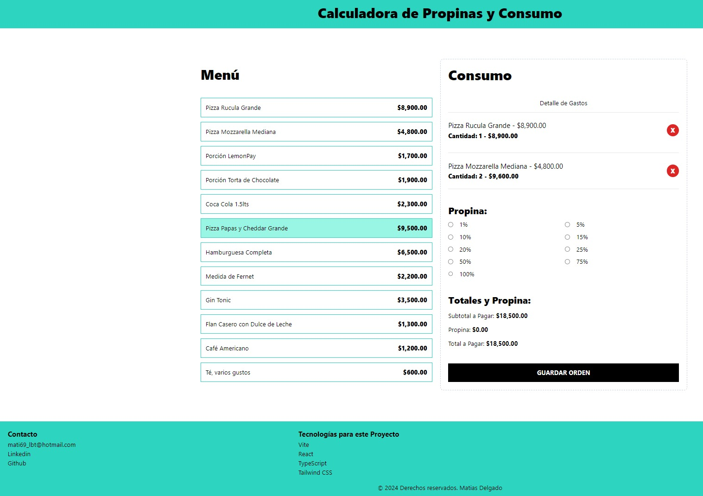
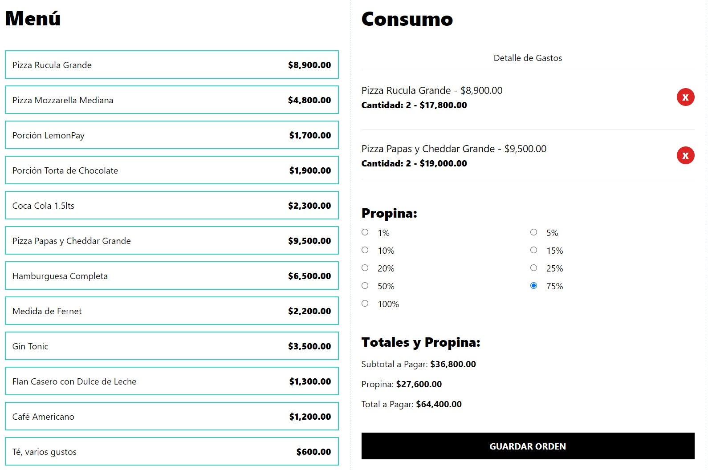

# Calculadora de Propinas y Consumo

Una aplicación web que permite calcular propinas y registrar el consumo de alimentos y bebidas en un restaurante. Este proyecto está desarrollado con React, TypeScript, Tailwind CSS y Vite.

## Capturas de Pantalla

## Características

- Mostrar un menú de alimentos y bebidas.
- Registrar el consumo de los ítems seleccionados.
- Calcular el total del consumo incluyendo la propina.
- Interfaz responsiva y amigable para dispositivos móviles.

## Motivación

Este es mi primer proyecto pequeño con TypeScript. Al principio, me costó un poco entenderlo, pero con práctica, todo se aprende.

## Tecnologías Utilizadas

- **React**: Librería de JavaScript para construir interfaces de usuario.
- **TypeScript**: Un superconjunto de JavaScript que añade tipos estáticos.
- **Tailwind CSS**: Un framework CSS para diseño rápido y personalizado.
- **Vite**: Un build tool que proporciona un entorno de desarrollo rápido.

## Despliegue

El proyecto está desplegado en Netlify y se puede acceder a través del siguiente enlace: [Calculadora de Propinas y Consumo](https://cartaqr.netlify.app/)

## Scripts Disponibles

- **`npm run dev`**: Inicia el servidor de desarrollo.
- **`npm run build`**: Construye la aplicación para producción.
- **`npm run lint`**: Ejecuta ESLint para encontrar y arreglar problemas en el código.
- **`npm run preview`**: Previsualiza la aplicación construida.

## Contacto

Para más información, puedes contactarme en:

- Email: mati69_lbt@hotmail.com
- [LinkedIn](https://www.linkedin.com/in/matiasdelgadodev/)
- [GitHub](https://github.com/Mati69lbt)